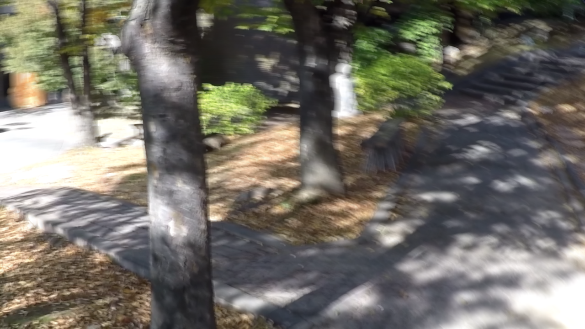
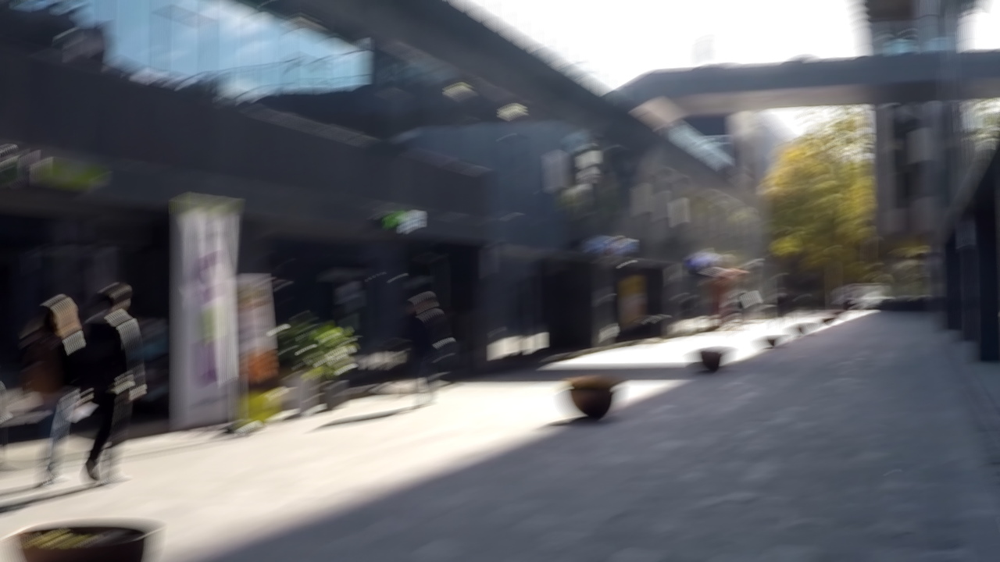
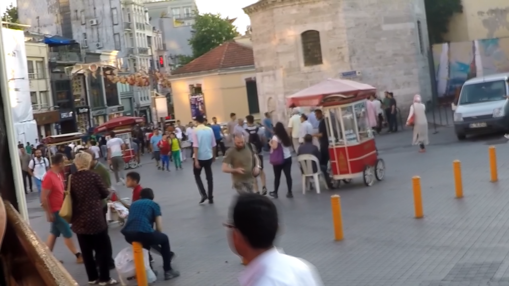

# 🖼️ Image Restoration Using DGUNet and Sparse Transform

This project implements an **Image Restoration Pipeline** that performs:

- **Image Deblurring** using **DGUNet** (Deep Gradient UNet)
- **Low-Light Enhancement** using **Sparse Transform-based Enhancement**

It is aimed at improving visual quality of degraded images for better aesthetics and further processing (e.g., computer vision tasks).

---

## 📌 Features

✅ Deblurring of motion-blurred or defocused images using DGUNet  
✅ Enhancement of underexposed/low-light images using sparse priors  
✅ Modular pipeline with intermediate and final outputs  
✅ Visual comparison and batch processing support

---

## 🧠 Methodology

### 1. Deblurring with DGUNet

DGUNet is a UNet-based architecture that integrates deep gradient priors to recover sharp details from blurred images. It is effective for both motion and defocus blur types. Key benefits:

- Gradient information guidance
- Edge-aware recovery
- Preserves fine textures

### 2. Low-Light Enhancement with Sparse Transform

This method uses sparse representation in a transform domain to selectively amplify useful details in low-light regions while suppressing noise. It avoids overexposure and improves visibility without distorting color.

---

### Results
| Input Image | Ground Truth | Final Enhanced Output |
|----------------|------------------|------------------------|
| |  | |
| |  | |
 |  | |

