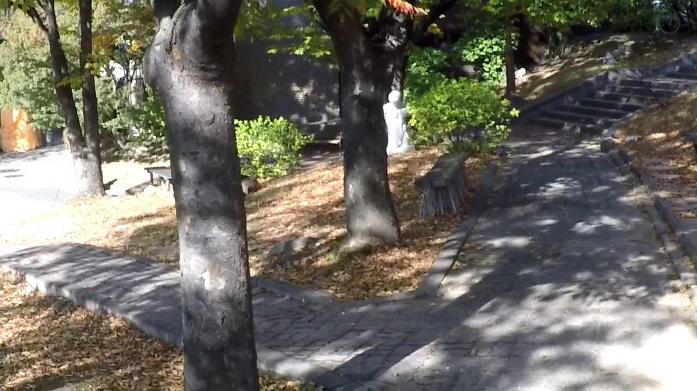
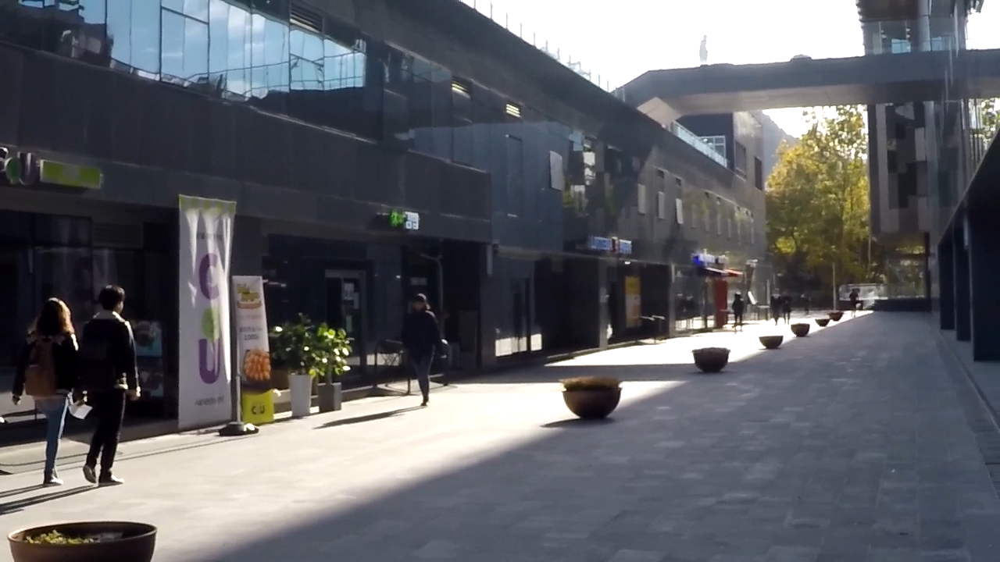
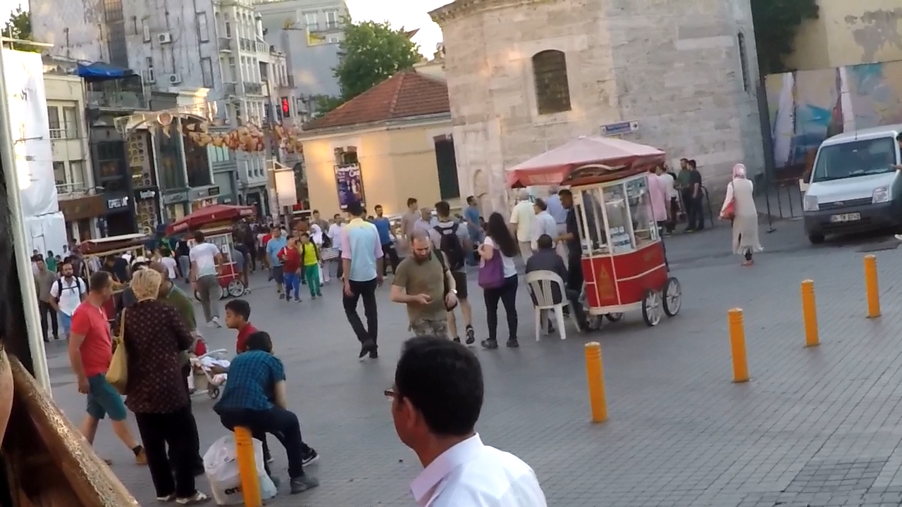
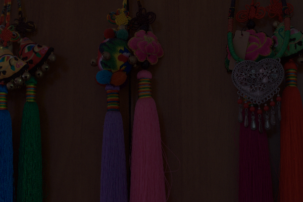
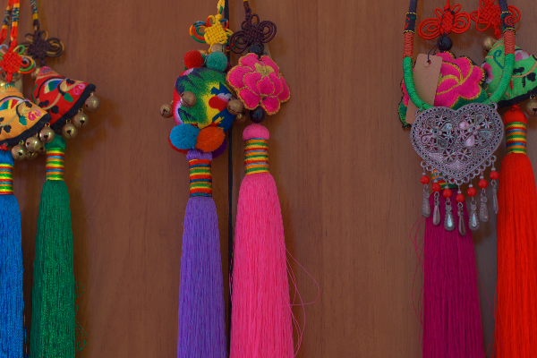
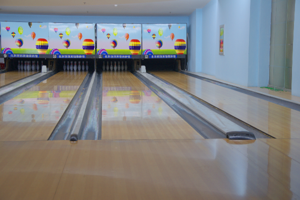
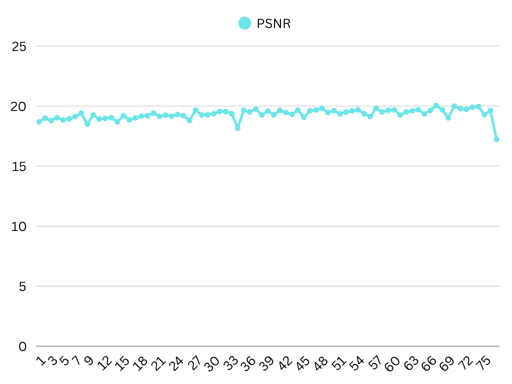
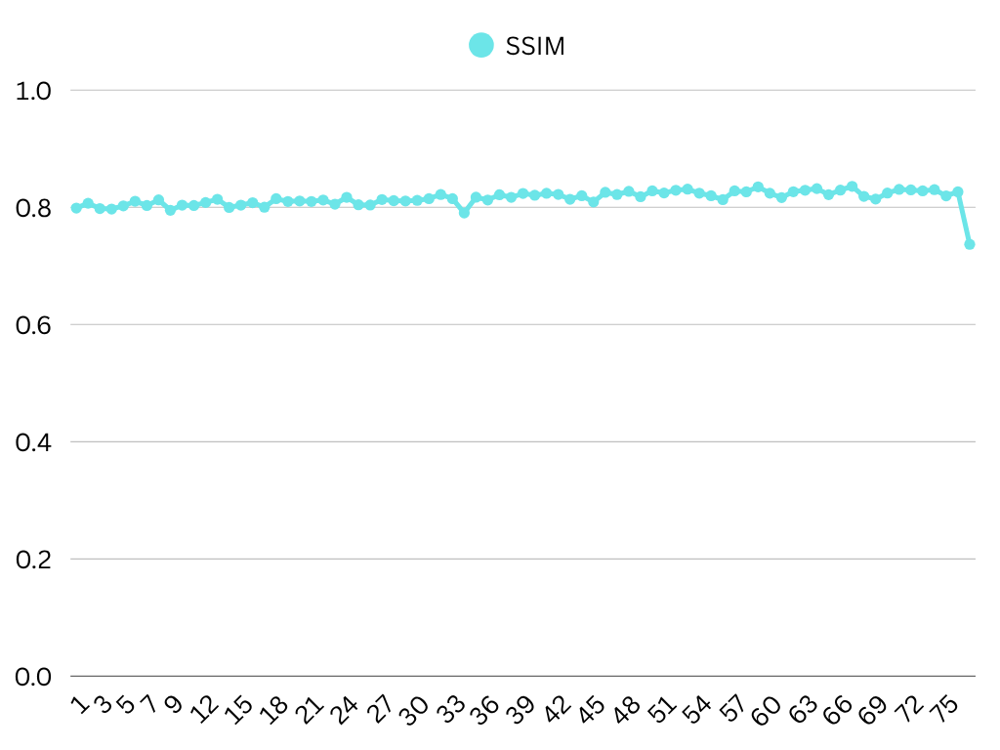

# 🖼️ Image Restoration Using DGUNet and Sparse Transform

This project implements an **Image Restoration Pipeline** that performs:

- **Image Deblurring** using **DGUNet** (Deep Gradient UNet)
- **Low-Light Enhancement** using **Sparse Transform-based Enhancement**

It is aimed at improving visual quality of degraded images for better aesthetics and further processing (e.g., computer vision tasks).

---

## 📌 Features

✅ Deblurring of motion-blurred or defocused images using DGUNet  
✅ Enhancement of underexposed/low-light images using sparse priors  
✅ Modular pipeline with intermediate and final outputs  
✅ Visual comparison and batch processing support

---

## 🧠 Methodology

### 1. Deblurring with DGUNet

DGUNet is a UNet-based architecture that integrates deep gradient priors to recover sharp details from blurred images. It is effective for both motion and defocus blur types. Key benefits:

- Gradient information guidance
- Edge-aware recovery
- Preserves fine textures
  

### 2. Low-Light Enhancement with Sparse Transform

This method uses sparse representation in a transform domain to selectively amplify useful details in low-light regions while suppressing noise. It avoids overexposure and improves visibility without distorting color.

---

## Results
  ### 1. Deblurring
| Input Image | Ground Truth | Final Enhanced Output |
|----------------|------------------|------------------------|
| |  | |
| |  | |
 |  | |

### 2. Low Light Enhancement
| Input Image | Ground Truth | Final Enhanced Output |
|----------------|------------------|------------------------|
| |  | |
| |  | |
| |  | |
 |  | |

---

## Evaluation of Models
Evaluation is based on Peak Signal-to-Noise Ratio (PSNR) and Structural Similarity Index (SSIM)—two standard metrics for assessing image quality.
CNN Network for Image Deblurring
### 1.The DGUNET model 
This model aims to restore sharp details from blurred images.  
•	**PSNR: 27.69 dB** – Indicates strong recovery of fine details and low reconstruction error. 
•	**SSIM: 0.9089** – Suggests high structural similarity to the original sharp images.  
Interpretation:
These results demonstrate that the CNN model is highly effective at removing blur, preserving edges and textures with strong perceptual and numerical quality.
### 2. Sparse Transformer for Low-Light Enhancement
This model is designed to enhance visibility in poorly lit images.  
•	**PSNR: 19.46 dB** – Reflects reasonable restoration under difficult lighting conditions. 
•	**SSIM: 0.82** – Indicates moderate structural preservation and perceptual enhancement.  
Interpretation:
The transformer enhances brightness and contrast effectively but shows some limitations in recovering fine details and reducing noise under extreme low-light scenarios.
Each model performs well within its domain:
•	The CNN excels at deblurring, offering high visual fidelity and sharp reconstruction.
•	The Sparse Transformer improves low-light visibility, though with slightly lower structural accuracy.

